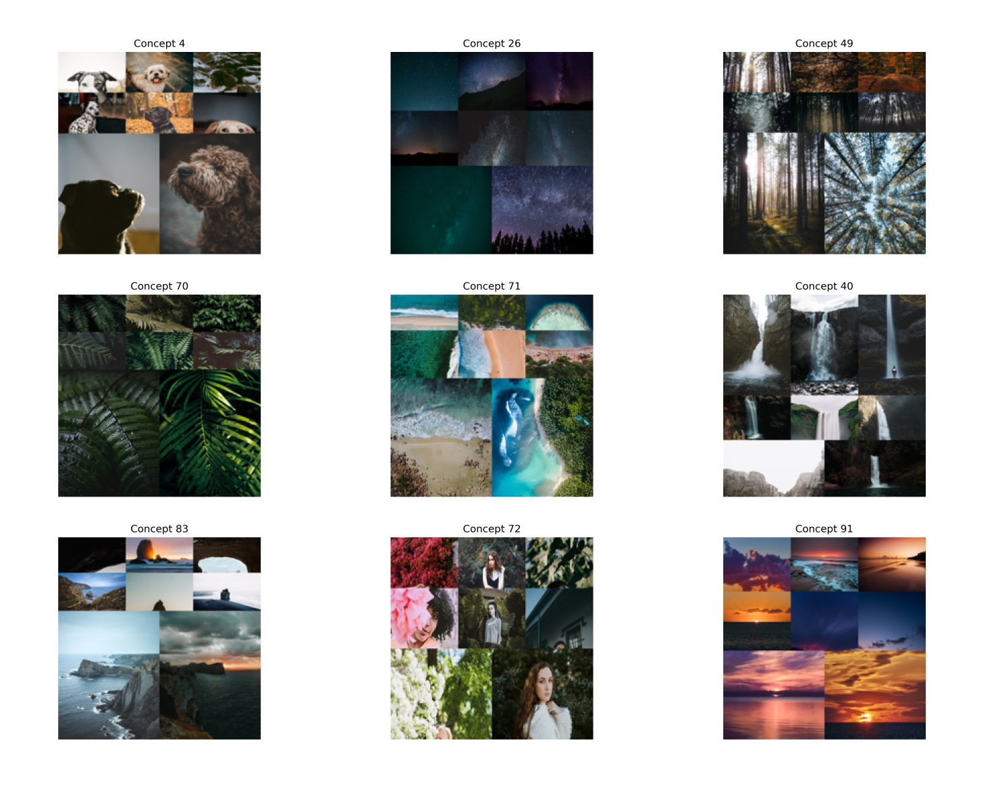
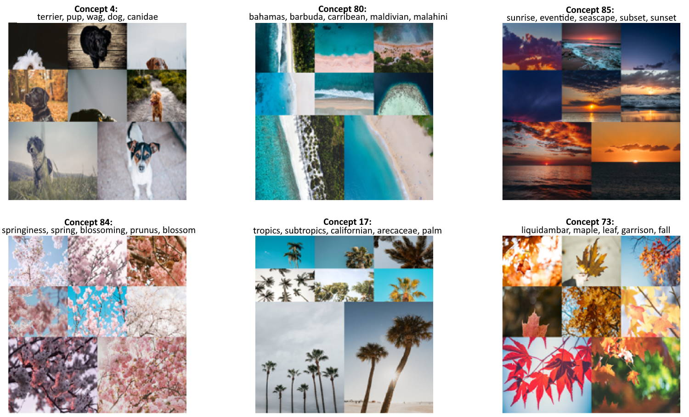

[](https://pypi.org/project/concept/)
[](https://pypi.org/project/concept/)
[](https://maartengr.github.io/concept/)
[](https://github.com/MaartenGr/concept/blob/master/LICENSE)

# Concept


**Concept** is a technique that leverages CLIP and BERTopic-based techniques to perform Concept Modeling on images.

Since topics are part of conversations and text, they do not represent the context of images well. Therefore, these clusters of images are 
referred to as 'Concepts' instead of the traditional 'Topics'.

Thus, **Concept Modeling** takes inspiration from topic modeling techniques 
to cluster images, find common concepts and model them both visually 
using images and textually using topic representations.

## Installation

Installation, with sentence-transformers, can be done using [pypi](https://pypi.org/project/concept/):

```bash
pip install concept
```

## Quick Start
First, we need to download and extract 25.000 images from Unsplash used in the sentence-transformers 
example:

```python
import os
import glob
import zipfile
from tqdm import tqdm
from sentence_transformers import util

# 25k images from Unsplash
img_folder = 'photos/'
if not os.path.exists(img_folder) or len(os.listdir(img_folder)) == 0:
    os.makedirs(img_folder, exist_ok=True)
    
    photo_filename = 'unsplash-25k-photos.zip'
    if not os.path.exists(photo_filename):   #Download dataset if does not exist
        util.http_get('http://sbert.net/datasets/'+photo_filename, photo_filename)
        
    #Extract all images
    with zipfile.ZipFile(photo_filename, 'r') as zf:
        for member in tqdm(zf.infolist(), desc='Extracting'):
            zf.extract(member, img_folder)
img_names = list(glob.glob('photos/*.jpg'))
```

Next, we only need to pass images to **Concept**:

```python
from concept import ConceptModel
concept_model = ConceptModel()
concepts = concept_model.fit_transform(img_names)
```

The resulting concepts can be visualized through `concept_model.visualize_concepts()`:



However, to get the full experience, we need to label the concept clusters with topics. To do this, 
we need to create a vocabulary. We are going to feed our model with 50.000 nouns from the English 
vocabulary: 

```python
import random
import nltk
nltk.download("wordnet")
from nltk.corpus import wordnet as wn

all_nouns = [word for synset in wn.all_synsets('n') for word in synset.lemma_names() if "_" not in word]
selected_nouns = random.sample(all_nouns, 50_000)
```

Then, we can pass in the resulting `selected_nouns` to **Concept**:

```python
from concept import ConceptModel

concept_model = ConceptModel()
concepts = concept_model.fit_transform(img_names, docs=selected_nouns)
```

Again, the resulting concepts can be visualized. This time however, we can also see the generated topics 
through `concept_model.visualize_concepts()`:



**NOTE**: Use `Concept(embedding_model="clip-ViT-B-32-multilingual-v1")` to select a model that supports 50+ languages.

## Search Concepts
We can quickly search for specific concepts by embedding a search term and finding the cluster embeddings 
that best represent them. As an example, let us search for the term `beach` and see what we can find. 
To do this, we simply run the following:

```python
>>> concept_model.find_concepts("beach")
[(100, 0.277577825349102),
 (53, 0.27431058773894657),
 (95, 0.25973751319723837),
 (77, 0.2560122597417548),
 (97, 0.25361988261846297)]
```

Each tuple contains two values, the first is the concept cluster and the second the similarity to the 
search term. The top 5 similar topics are returned. 

Now, let us visualize those concepts to see how well the search function works:

```python
concept_model.visualize_concepts(concepts=[100, 53, 95, 77, 97])
``` 


 