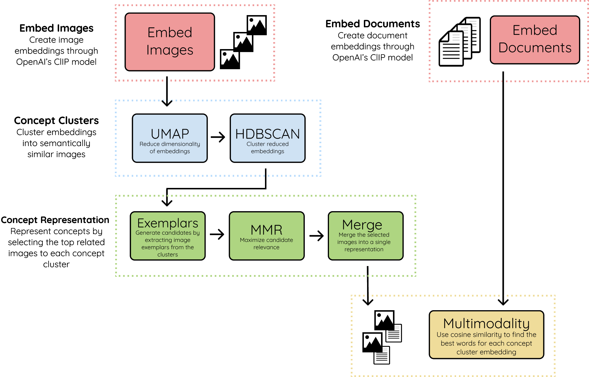
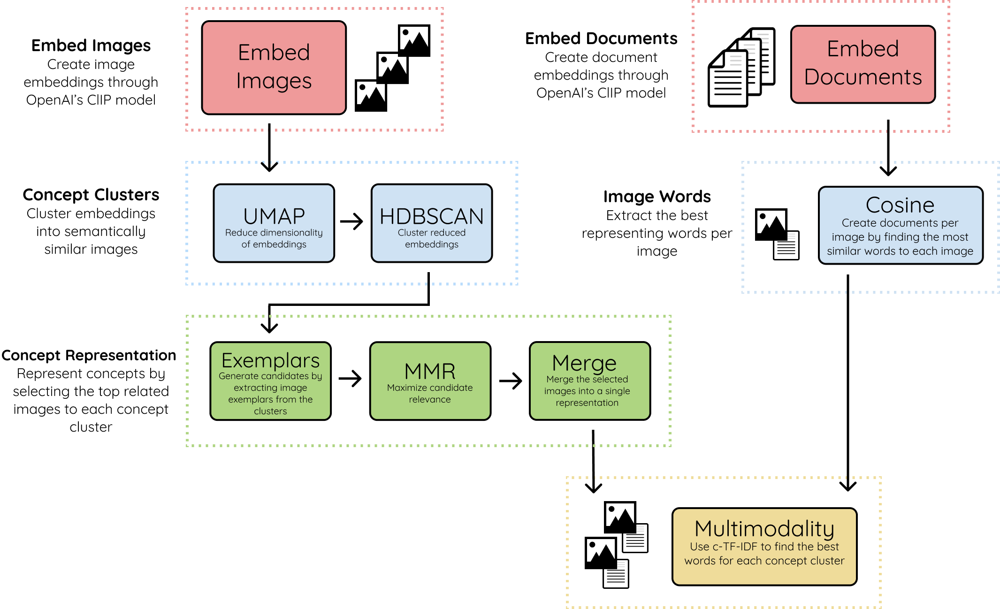

There are two variations of the Concept algorithm, one primarily using **cosine similarity** to find 
words related to concept clusters and one using **c-TF-IDF** instead to find the related words to each concept cluster. 

# Concept - Cosine Similarity

For those that are interested in the underpinnings of Concept, below is an abstract overview of the method used to create the resulting concepts.

## 1. **Embed Images & Documents**
We start by embedding both images and documents into the same vector space using OpenAI's CLIP model. 
This allows us to make comparisons between images and text. The documents can be words, phrases, sentences, etc. 
Whatever you feel best represents the concept clusters.

## 2. **Concept Clusters**
Using UMAP + HDBSCAN we cluster the image embeddings to create clusters that are visually and semantically similar to each other. 
We refer to the clusters as concepts as they represent a multimodal nature.

## 3. **Concept Representation**
To visually represent the concept clusters, we take the most related images to each concept, called exemplars. 
Depending on the concept cluster size, the number of exemplars for each cluster may exceed the hundreds so a filter is needed.

We use MMR to select images that are most related to the concept embedding but still sufficiently dissimilar to each other. 
This way, we can show as much of the concept as possible. The selected images are then combined into a single image to create a single visual representation.

## 4. **Multimodality**
Lastly, we take the textual embeddings and compare them with the created concept cluster embeddings. 
Using cosine similarity, we select the embeddings that are most related to one another. 
This introduces multimodality into the concept representation.

# Concept - c-TF-IDF

A second version of Concept can be found leverages c-TF-IDF to generate the concept representations. It 
uses OpenAI's CLIP to find the top 10 best representing words for each image. That way, we can generate documents 
for each image. Then, we group all words per concept cluster and finally run c-TF-IDF to find the best textual 
representation of the concept clusters:

